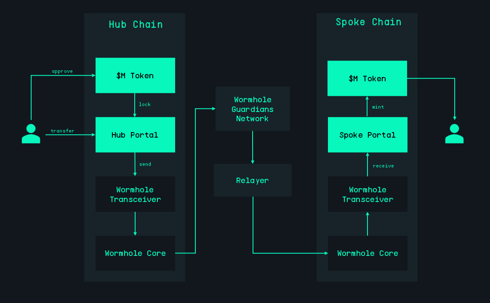

# M Portal

The aim of M^0 cross-chain strategy is to make $M token natively multichain, offering users the same yield-earning capabilities on different chains while maintaining $M issuance and governance on Ethereum.

**M Portals** are the main components of M^0 multichain model responsible for bridging tokens and propagating system information. They utilize [Wormhole's NTT framework](https://wormhole.com/docs/learn/messaging/native-token-transfers/) for cross-chain communication.

## Architecture

Since both governance and issuance of new $M tokens are done exclusively on Ethereum, the M^0 multichain model employs different implementations of the Portal contract on different chains. On Ethereum, `HubPortal` uses a _lock-and-release_ mechanism for token transfers and enables the propagation of $M earning index and TTG registrar values to other chains. Conversely, `SpokePortal`, deployed on all other chains, follows a _mint-and-burn_ model for bridging tokens and is responsible for updating $M earning index and TTG registrar values based on messages received from `HubPortal`.

Both HubPortal and SpokePortal inherit Wormhole's `NttManager` contract that encapsules all the necessary cross-chain messaging functionality.

### M Token Transfer

When a user transfers tokens from the Hub chain to a Spoke chain, the tokens are locked in the `HubPortal`, and a cross-chain message is sent to the Spoke chain via `WormholeTransceiver`. Upon receiving the message, an equivalent number of tokens is minted on the Spoke chain and transferred to the user. Similarly, when transferring M tokens from a Spoke chain back to the Hub, the tokens are burned on the Spoke chain, and an equivalent number of tokens is released on the Hub chain. Bridging $M tokens between Spoke chains involves minting and burning operations on both chains, without affecting the total number of $M tokens locked in `HubPortal`.



### Earning Index Propagation

$M is a yield-bearing token with built-in earning functionality for a selected set of earners approved by TTG. The maximum earner rate is determined through TTG governance, while an additional safe earner rate is automatically derived based on the total active owed $M and the total earning supply.

This safe rate is calculated in [EarnerRateModel](https://etherscan.io/address/0x6b198067E22d3A4e5aB8CeCda41a6Da56DBf5F59#code) contract on Ethereum. The $M index represents the accrual of this rate to all earners in the system. Propagating the earner rate is essential for accurate yield distribution across the M^0 Protocol on Ethereum and other chains.

There are two ways to update the $M earning index on a Spoke chain:

- Perform a cross-chain transfer from the Hub chain.
- Explicitly call `sendMTokenIndex` function in `HubPortal`.

### TTG Registrar Values Propagation

M^0 system parameters approved by the governance are stored in `Registrar` contract on Ethereum. `HubPortal` propagates those parameters to Spoke chains.

## Development

### Installation

You may have to install the following tools to use this repository:

- [Foundry](https://github.com/foundry-rs/foundry) to compile and test contracts
- [lcov](https://github.com/linux-test-project/lcov) to generate the code coverage report
- [slither](https://github.com/crytic/slither) to static analyze contracts

Install dependencies:

```bash
npm install
forge install
```

### Env

Copy `.env` and write down the env variables needed to run this project.

```bash
cp .env.example .env
```

### Compile

Run the following command to compile the contracts:

```bash
npm run compile
```

### Coverage

Forge is used for coverage, run it with:

```bash
npm run coverage
```

You can then consult the report by opening `coverage/index.html`:

```bash
open coverage/index.html
```

### Test

To run all tests:

```bash
npm test
```

Run test that matches a test contract:

```bash
forge test --mc <test-contract-name>
```

Test a specific test case:

```bash
forge test --mt <test-case-name>
```

To run slither:

```bash
npm run slither
```

### Code quality

[Husky](https://typicode.github.io/husky/#/) is used to run [lint-staged](https://github.com/okonet/lint-staged) and tests when committing.

[Prettier](https://prettier.io) is used to format code. Use it by running:

```bash
npm run prettier
```

[Solhint](https://protofire.github.io/solhint/) is used to lint Solidity files. Run it with:

```bash
npm run solhint
```

To fix solhint errors, run:

```bash
npm run solhint-fix
```

### Documentation

The documentation can be generated by running:

```bash
npm run doc
```

It will run a server on port 4000, you can then access the documentation by opening [http://localhost:4000](http://localhost:4000).

## Deployment

### Build

To compile the contracts for production, run:

```bash
npm run build
```

### Deploy

#### Local

Open a new terminal window and run [anvil](https://book.getfoundry.sh/reference/anvil/) to start a local chain:

```bash
anvil
```

Deploy the contracts by running:

```bash
npm run deploy-local
```

#### Sepolia

To deploy to the Sepolia testnet, run:

```bash
npm run deploy-sepolia
```
